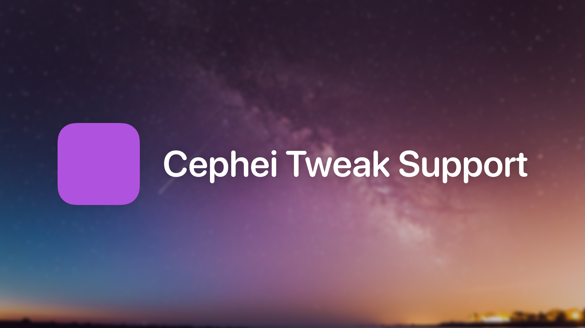

# 
Cephei is a framework for jailbroken iOS devices that includes various convenience features for developers. Primarily, it focuses on settings-related features, but it also contains other utilties. I hope you’ll appreciate what it has to offer.

All iOS versions since 5.0 are supported, on all devices.

Documentation is available at **[hbang.github.io/libcephei](https://hbang.github.io/libcephei/)**.

## Integrating Cephei into a Theos project
If you need to install Cephei, visit [chariz.com/get/cephei](https://chariz.com/get/cephei) on your device and tap the Install button.

Theos includes headers and linkable frameworks for Cephei, so you don’t need to worry about copying files over from your device. You can also find these as zipped-up SDKs on the [GitHub releases](https://github.com/hbang/libcephei/releases) page.

For all projects that will be using Cephei, add it to the instance’s frameworks list:

```makefile
MyAwesomeTweak_EXTRA_FRAMEWORKS += Cephei
```

If you are using CepheiUI or CepheiPrefs components (refer to the sidebar of the [documentation](https://hbang.github.io/libcephei/)), make sure to also add those names to the frameworks list.

You can now use Cephei components in your project.

You must also add `ws.hbang.common` to the `Depends:` list in your control file. If Cephei isn’t present on the device, your binaries will fail to load. For example:

```yaml
Depends: mobilesubstrate, something-else, some-other-package, ws.hbang.common (>= 1.17)
```

You should specify the current version of Cephei as the minimum requirement, so you can guarantee all features you use are available.

## Trying it out
You can take a look at a demo of CepheiPrefs by copying `/Library/PreferenceBundles/Cephei.bundle/entry.plist` to `/Library/PreferenceLoader/Preferences/Cephei.plist` – quit and relaunch Settings if it’s open. Alternatively, you can compile Cephei yourself – when compiling a debug build, the Cephei Demo preference bundle will be visible by default.

## License
Licensed under the Apache License, version 2.0. Refer to [LICENSE.md](https://github.com/hbang/libcephei/blob/v1/LICENSE.md).

Header backdrop photo credit: [Kristopher Roller](https://unsplash.com/@krisroller) on Unsplash
